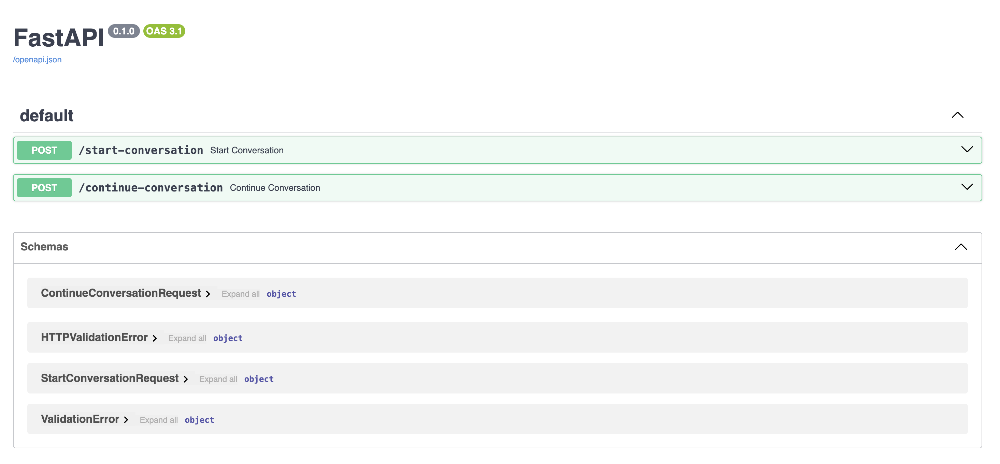
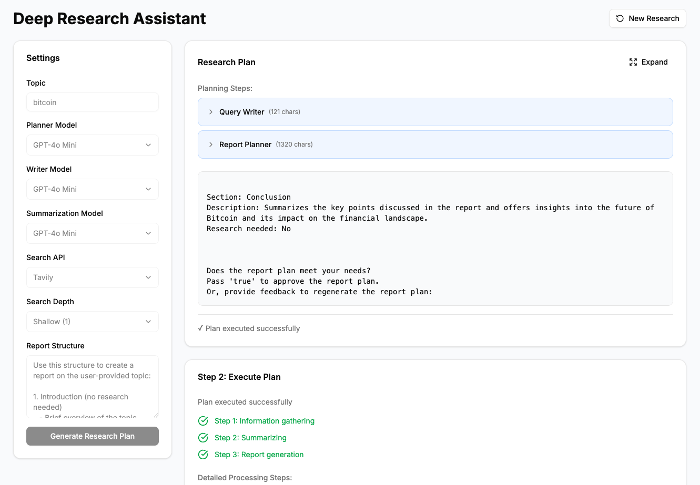

# Local Full Stack Deep Research

[English](README.md) | [中文](README.zh-CN.md)

A powerful full-stack application for local deep research powered by LangGraph, supporting multiple LLM providers and search APIs. The graph implementation is referenced from [open_deep_research](https://github.com/langchain-ai/open_deep_research).





## Features

- 🤖 Multiple LLM Provider Support:
  - OpenAI
  - Anthropic
  - Ollama
  - And more...
- 🔍 Multiple Search API Integration:
  - Tavily
  - DuckDuckGo
  - And more...
- 🚀 Built with modern technologies:
  - Backend: FastAPI + LangGraph
  - Frontend: Next.js 15 + React 19
  - TypeScript support
  - Modern UI with Radix UI and Tailwind CSS

## Project Structure

```
.
├── apps/
│   ├── backend/         # FastAPI backend
│   │   ├── open_deep_research/  # Core backend logic
│   │   └── notebooks/   # Jupyter notebooks
│   └── frontend/        # Next.js frontend
│       ├── app/         # Next.js app directory
│       ├── components/  # React components
│       └── lib/         # Utility functions
```

## Prerequisites

- Python 3.11+
- Node.js (Latest LTS version)
- pnpm 10.12.1+

## Getting Started

### Local Development

#### Backend Setup

1. Navigate to the backend directory:
   ```bash
   cd apps/backend
   ```

2. Create and activate a virtual environment:
   ```bash
   python -m venv .venv
   source .venv/bin/activate  # On Windows: .venv\Scripts\activate
   ```

3. Install dependencies:
   ```bash
   pip install -e .
   ```

   > **Note**: It's recommended to use `uv` for dependency management. See [uv documentation](https://docs.astral.sh/uv/) for more details.
   > ```bash
   > # Install uv
   > brew install uv  # On Linux/macOS
   > powershell -ExecutionPolicy ByPass -c "irm https://astral.sh/uv/install.ps1 | iex" # On Windows
   > 
   > # Sync dependencies
   > uv sync
   > 
   > # activate the virtual environment
   > source .venv/bin/activate  # On Linux/macOS
   > .venv\Scripts\activate     # Windows
   >
   > # run the backend
   > uvicorn main:app --host 0.0.0.0 --port 8000 --reload
   > ```

4. Set up your environment variables in `.env`:
   ```
   OPENAI_API_KEY=your_key_here
   ANTHROPIC_API_KEY=your_key_here
   TAVILY_API_KEY=your_key_here
   ```

5. Start the backend server:
   ```bash
   uvicorn main:app --host 0.0.0.0 --port 8000 --reload
   ```

#### Frontend Setup

1. Navigate to the frontend directory:
   ```bash
   cd apps/frontend
   ```

2. Install dependencies:
   ```bash
   pnpm install
   ```

3. Start the development server:
   ```bash
   pnpm dev
   ```

### Development URLs

- Backend API: `http://localhost:8000`
- Frontend: `http://localhost:3000`

### Docker Deployment

To run the entire application using Docker:

```bash
docker compose up
```

## License

MIT 