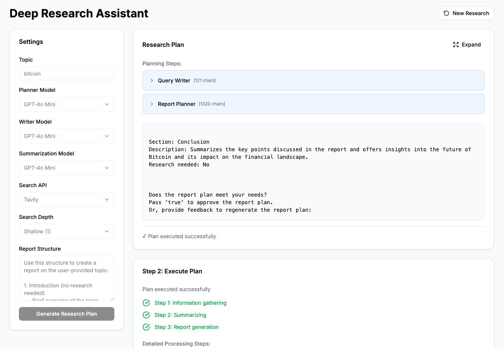

# 本地全栈深度研究应用

一个基于 LangGraph 构建的强大全栈本地深度研究应用，支持多种 LLM 提供商和搜索 API。图实现参考自 [open_deep_research](https://github.com/langchain-ai/open_deep_research)。




## 功能特点

- 🤖 多 LLM 提供商支持：
  - OpenAI
  - Anthropic
  - Ollama
  - 更多...
- 🔍 多搜索 API 集成：
  - Tavily
  - DuckDuckGo
  - 更多...
- 🚀 采用现代技术栈：
  - 后端：FastAPI + LangGraph
  - 前端：Next.js 15 + React 19
  - TypeScript 支持
  - 使用 Radix UI 和 Tailwind CSS 构建的现代界面

## 项目结构

```
.
├── apps/
│   ├── backend/         # FastAPI 后端
│   │   ├── open_deep_research/  # 核心后端逻辑
│   │   └── notebooks/   # Jupyter 笔记本
│   └── frontend/        # Next.js 前端
│       ├── app/         # Next.js 应用目录
│       ├── components/  # React 组件
│       └── lib/         # 工具函数
```

## 环境要求

- Python 3.11+
- Node.js（最新 LTS 版本）
- pnpm 10.12.1+

## 快速开始

### 本地开发

#### 后端设置

1. 进入后端目录：
   ```bash
   cd apps/backend
   ```

2. 创建并激活虚拟环境：
   ```bash
   python -m venv .venv
   source .venv/bin/activate  # Windows: .venv\Scripts\activate
   ```

3. 安装依赖：
   ```bash
   pip install -e .
   ```

   > **注意**：推荐使用 `uv` 进行依赖管理。详见 [uv 文档](https://docs.astral.sh/uv/)。
   > ```bash
   > # 安装 uv
   > brew install uv  # Linux/macOS
   > powershell -ExecutionPolicy ByPass -c "irm https://astral.sh/uv/install.ps1 | iex" # Windows
   > 
   > # 同步依赖
   > uv sync
   > 
   > # 激活虚拟环境
   > source .venv/bin/activate  # Linux/macOS
   > .venv\Scripts\activate     # Windows
   >
   > # 运行后端
   > uvicorn main:app --host 0.0.0.0 --port 8000 --reload
   > ```

4. 在 `.env` 文件中设置环境变量：
   ```
   OPENAI_API_KEY=你的密钥
   ANTHROPIC_API_KEY=你的密钥
   TAVILY_API_KEY=你的密钥
   ```

5. 启动后端服务器：
   ```bash
   uvicorn main:app --host 0.0.0.0 --port 8000 --reload
   ```

#### 前端设置

1. 进入前端目录：
   ```bash
   cd apps/frontend
   ```

2. 安装依赖：
   ```bash
   pnpm install
   ```

3. 启动开发服务器：
   ```bash
   pnpm dev
   ```

### 开发地址

- 后端 API：`http://localhost:8000`
- 前端：`http://localhost:3000`

### Docker 部署

使用 Docker 运行整个应用：

```bash
docker compose up
```

## 许可证

MIT 